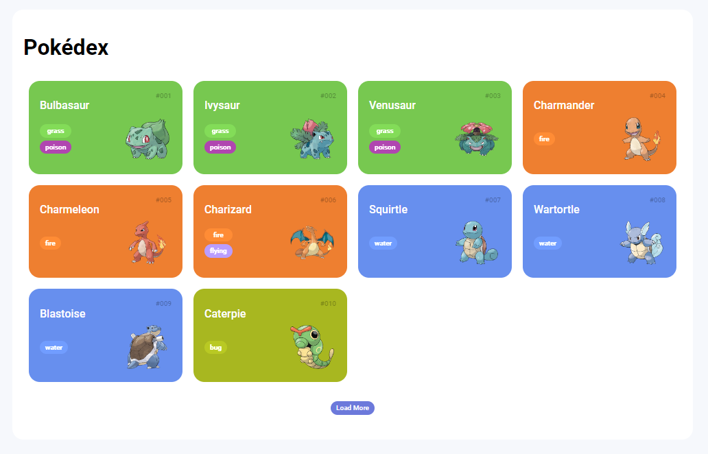
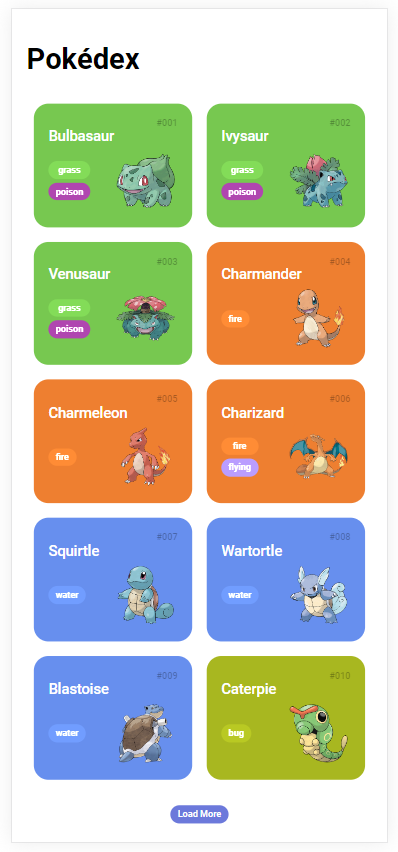
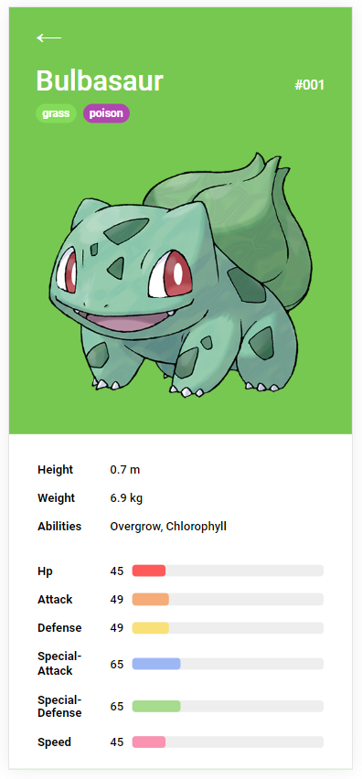

# Trilha JS Developer - Pokédex

[www.dio.me](https://www.dio.me/)

## Descrição

A proposta do desafio é criar a página com os detalhes do Pokémon para o projeto de Pokédex desenvolvido na trilha de JavaScript.

## Imagens

- Lista de Pokémon desenvolvida durante as aulas.  

- Página de detalhes desenvolvida para o desafio.  

- Visão mobile da lista.  

- Visão mobile dos detalhes.  

